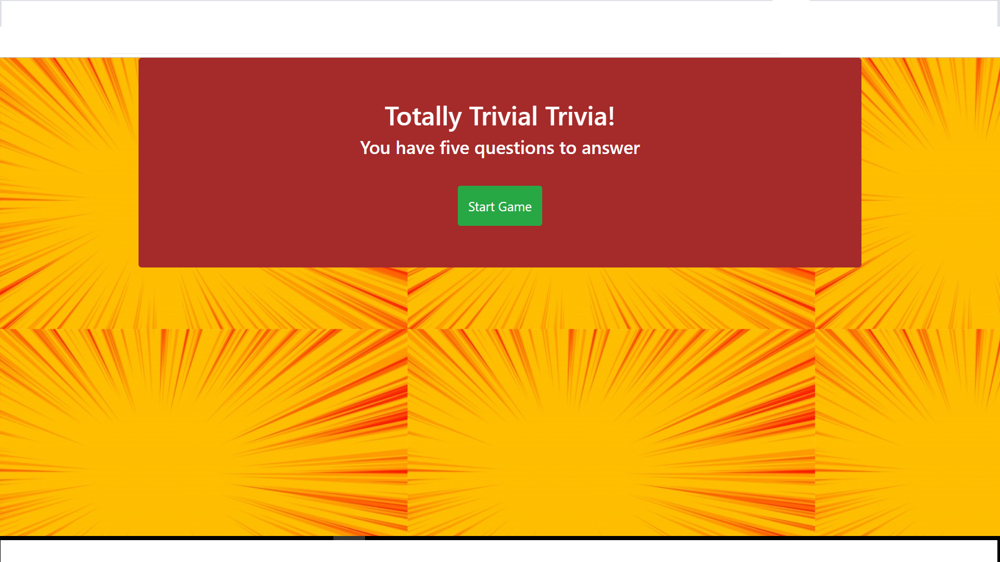

### Trivia Game:

### After each right answer 

### Wrong answer

##### Technologies used:

* HTML
* CSS(boot strap)
* JavaScript(JQuery)

##### Screenshot:

##### Code:

    $(document).on('click', '.choice', function() {
        clearInterval(timer);
        const selectedAnswer = $(this).attr('data-answer');
        const correctAnswer = quizQuestions[currentQuestion].correctAnswer;
    
        if (correctAnswer === selectedAnswer) {
            score++;
            console.log('Winsss!!!!');
            preloadImage('win');
            setTimeout(nextQuestion, 3 * 1000);
        } else {
            lost++;
            console.log('Lost!!!!');
            preloadImage('lost');
            setTimeout(nextQuestion, 3 * 1000);
        }
    });

